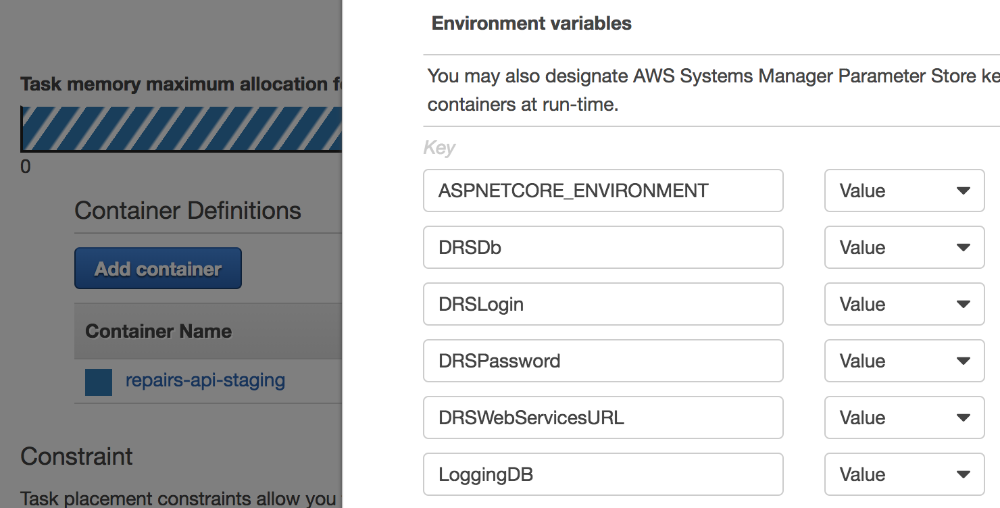

# Hackney API Platform

## Adding your application to the platform

> Coming soon.

## Setting up new application servers

### Step here

Description here.

## Setting environment variables for a container in ECS

Containers in ECS are configured by Task Definitions, which are in turn managed by Services.

1. Go to the ECS dashboard.
2. Look for the Task Definition for your app in the correct environment.
2. Create a new revision of that Task Definition. Any time you make a change, you must create a new revision, so any Service(s) running this Task know to restart it.
3. Scroll down and expand the containers you need to change environment variables for.
4. Add/update/remove your environment variables in the list.
5. Save the new revision.
6. Now go to the cluster and look for the Service for your app in the correct environment.
7. Update the service to use your new revision of the Task Definition.
8. Check "force new deployment".
9. Click through the rest of the steps and save the Service.
10. The application will be redeployed in 5-10 minutes with new environment variables. You can watch the rolling release in the "Deployments" tab of the Service.
